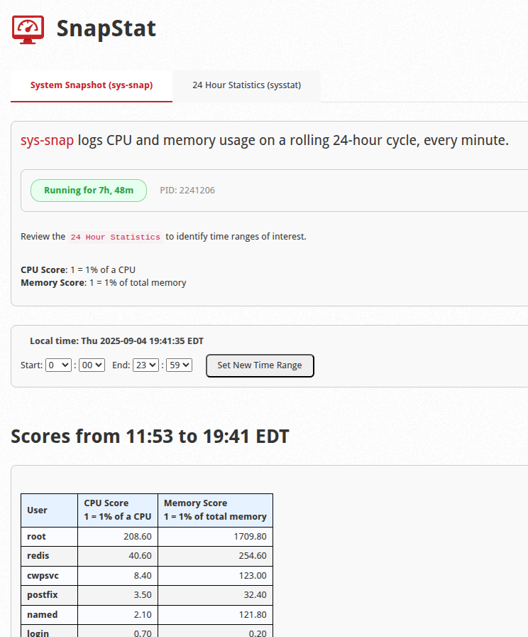
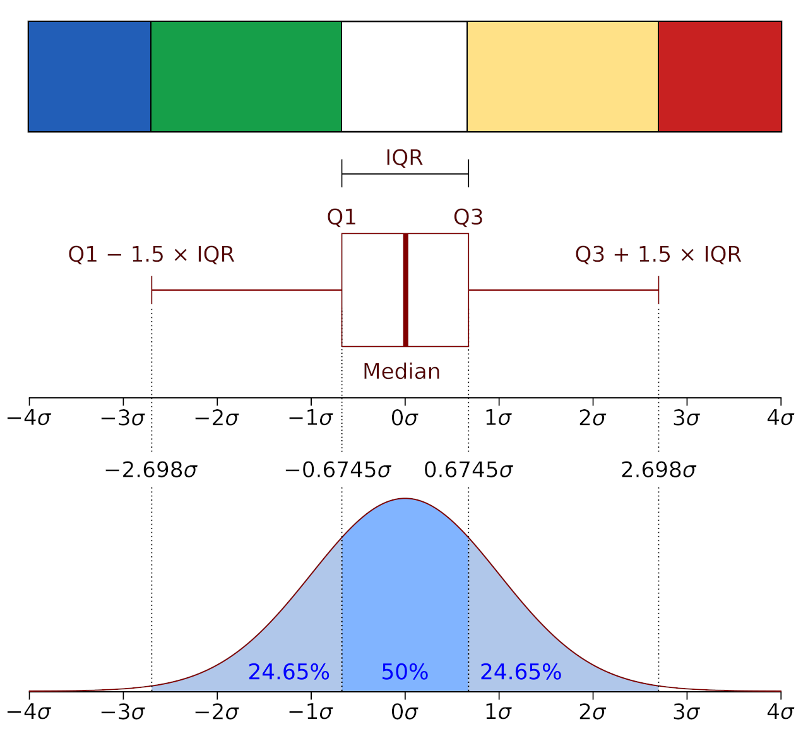

# SnapStat (imh-snap-stat), v0.1.8

sys-snap and sysstat Web Interface for cPanel/WHM and CWP

(https://www.youtube.com/watch?v=l6C9AdDgy_I)

- cPanel/WHM path: `/usr/local/cpanel/whostmgr/docroot/cgi/imh-snap-stat/index.php`
- CWP path: `/usr/local/cwpsrv/htdocs/resources/admin/modules/imh-snap-stat.php`

(screenshot2.png)

# Installation

- Run as the Root user: `curl -fsSL https://raw.githubusercontent.com/gemini2463/imh-snap-stat/master/install.sh | sh`

# Files

## Shell installer

- install.sh

## Main script

- index.php - Identical to `imh-snap-stat.php`.
- index.php.sha256 - `sha256sum index.php > index.php.sha256`
- imh-snap-stat.php - Identical to `index.php`.
- imh-snap-stat.php.sha256 - `sha256sum imh-snap-stat.php > imh-snap-stat.php.sha256`

## Javascript

- imh-snap-stat.js - Bundle React or any other javascript in this file.
- imh-snap-stat.js.sha256 - `sha256sum imh-snap-stat.js > imh-snap-stat.js.sha256`

## Icon

- imh-snap-stat.png - [48x48 png image](https://api.docs.cpanel.net/guides/guide-to-whm-plugins/guide-to-whm-plugins-plugin-files/#icons)
- imh-snap-stat.png.sha256 - `sha256sum imh-snap-stat.png > imh-snap-stat.png.sha256`

## cPanel conf

- imh-snap-stat.conf - [AppConfig Configuration File](https://api.docs.cpanel.net/guides/guide-to-whm-plugins/guide-to-whm-plugins-appconfig-configuration-file)
- imh-snap-stat.conf.sha256 - `sha256sum imh-snap-stat.conf > imh-snap-stat.conf.sha256`

## CWP include

- imh-plugins.php - [CWP include](https://wiki.centos-webpanel.com/how-to-build-a-cwp-module)
- imh-plugins.php.sha256 - `sha256sum imh-plugins.php > imh-plugins.php.sha256`

## sha256 one-liner

- `for file in index.php imh-plugins.php imh-snap-stat.conf imh-snap-stat.js imh-snap-stat.php imh-snap-stat.png; do sha256sum "$file" > "$file.sha256"; done`

# Changelog

## v0.1.6 - Release

- Release

## v0.1.7

- Fix for some newer OS's that use a new format to store sysstat logs.

## v0.1.8

- Fixed error handling of time-range inputs that fail to return sys-snap output.
- "Scores from..." now shows the actual time-range, specifically when sys-snap has been running for less than 24 hours.
- "Scores from..." now shows the local time zone.
- Added step to `chmod 0600` cache files when created.
- Implemented statistical outlier detection (IQR method) for all numeric columns in the sar data table. Cells with statistically and operationally significant values are now automatically highlighted.
- `/opt/imh-sys-snap/bin/` path to the sys-snap.pl file is no longer hard-coded; it now checks other possible paths.
- Fixed caching functions to prevent path traversals and race conditions.
